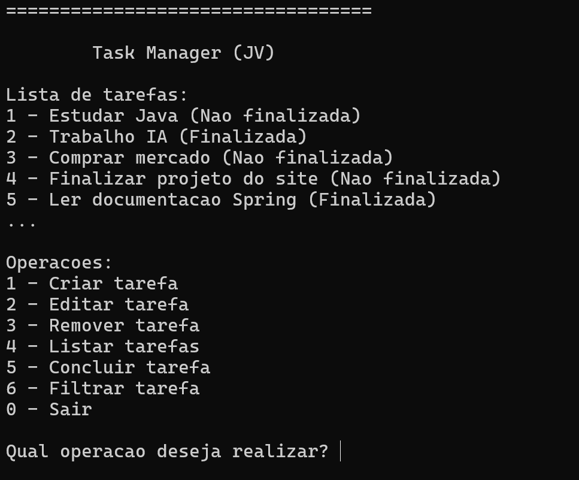

<h1 align="center" style="font-weight: bold;">Task Manager</h1>


<p align="center">
  <a href="#sobre">Sobre</a> • 
  <a href="#como_executar">Como Executar</a> • 
  <a href="#objetivo">Objetivo de Aprendizado</a> • 
  <a href="#detalhamento">Detalhamento</a> • 
  <a href="#melhorias">Próximas Melhorias</a> •
  <a href="#licenca">Licença</a>
</p>

<br>
<p align="center">
    
</p>
<br>

<h2 id="sobre">📌 Sobre</h2>

O Task Manager é uma aplicação de linha de comando (CLI) que permite criar e gerenciar tarefas de forma simples e eficiente.

O projeto foi desenvolvido como prática dos seguintes tópicos:

- Programação Orientada a Objetos
- Collections Framework
- Manipulação de Arquivos
- Streams e Lambdas
- Generics
- Enums
- Tratamento de Exceções
- Organização em Camadas

Todas as tarefas são armazenadas localmente em um arquivo de dados, permitindo que as informações sejam preservadas entre diferentes execuções do programa.

Este projeto foi criado com o objetivo de consolidar conhecimentos fundamentais da linguagem Java antes do estudo de tópicos mais avançados como concorrência, banco de dados, frameworks web e testes automatizados.

<br>

<h2 id="como_executar">▶️ Como Executar</h2>

### ⚙️ Pré-requisitos

Para executar o projeto é necessário possuir:

- [Java 21 ou superior](https://www.oracle.com/br/java/technologies/downloads/)

Verifique sua versão instalada:

```bash
java --version
```

### Executando uma Release

Baixe o arquivo `.jar` da última release disponível ([clique aqui](https://github.com/JoaoVitorDomingos/Task-Manager/releases)).

Execute:

```bash
java -jar task-manager-1.0.0.jar
```

### Compilando Localmente

Clone o repositório:

```bash
git clone https://github.com/JoaoVitorDomingos/Task-Manager.git
```

Entre na pasta do projeto:

```bash
cd Task-Manager/task_manager/
```

Compile o projeto:

```bash
mvn clean package
```

O arquivo gerado estará em:

```text
target/
```

Execute:

```bash
java -jar target/task-manager-1.0.0.jar
```

### 📦 Releases

As versões estáveis do projeto são disponibilizadas na área de Releases do GitHub ([clique aqui](https://github.com/JoaoVitorDomingos/Task-Manager/releases)).

Para consultar o histórico completo de alterações entre as versões, veja o arquivo [`CHANGELOG.md`](./CHANGELOG.md).

<br>

<h2 id="objetivo">🎯 Objetivo de Aprendizado</h2>

Este projeto foi desenvolvido após o estudo dos seguintes tópicos:

- Java Básico
- Orientação a Objetos
- Exceções
- Lambdas
- Anotações
- Optional
- Manipulação de Arquivos
- Collections Framework

Seu principal objetivo foi consolidar esses conhecimentos em um projeto prático antes do avanço para tópicos como:

- Concorrência
- Networking
- Banco de Dados
- Frameworks Web
- Testes Automatizados
- Logging

<br>

<h2 id="detalhamento">Detalhamento</h2>

<p>Nesta sessão detalharei sobre o projeto, citando os pontos mais importantes sobre ele e sua criação.</p>

<details>
  <summary><h3>Sumário</h3></summary>
  <ol>
    <li><a href="#funcionalidades">Funcionalidades</a></li>
    <li><a href="#arquitetura">Arquitetura</a></li>
    <li><a href="#conceitos_aplicados">Conceitos Aplicados</a></li>
    <li><a href="#persistência_dados">Persistência dos Dados</a></li>
  </ol>
</details>

<h3 id="funcionalidades">🚀 Funcionalidades</h3>

<strong>Gerenciamento de Tarefas</strong>

- Criar tarefas
- Editar tarefas
- Remover tarefas
- Marcar tarefas como concluídas

<strong>Sistema de Tags</strong>

- Adicionar tags às tarefas
- Remover tags das tarefas
- Evitar tags duplicadas

<strong>Busca e Filtragem</strong>

- Buscar tarefas por ID
- Filtrar tarefas por status
- Filtrar tarefas por tag

<strong>Ordenação</strong>

- Ordenação utilizando Comparator
- Suporte a diferentes critérios de ordenação

<strong>Persistência</strong>

- Salvamento automático ao encerrar o programa
- Carregamento automático ao iniciar o programa

<h3 id="arquitetura">🏗️ Arquitetura</h3>

O projeto foi organizado seguindo uma separação simples de responsabilidades:

```text
Main
 │
 ▼
TaskService
 │
 ▼
TaskRepository
 │
 ▼
Arquivo TXT
```

<strong>Main:</strong> Responsável pela interação com o usuário através do terminal.

<strong>TaskService:</strong> Contém as regras de negócio da aplicação.

<strong>TaskRepository:</strong> Responsável pela persistência dos dados em arquivo.

<strong>Task:</strong> Representa a entidade principal do sistema.

<h3 id="conceitos_aplicados">📚 Conceitos Aplicados</h3>

<strong>Collections Framework</strong>

- List
- Map
- Set
- Iterator
- Comparable
- Comparator

<strong>Programação Funcional</strong>

- Streams
- Lambdas
- Method References

<strong>Manipulação de Arquivos</strong>

- File
- Path
- Files
- BufferedReader
- BufferedWriter

<strong>Outros Conceitos</strong>

- Generics
- Enums
- Exceptions
- Optional
- Try-With-Resources

<h3 id="persistência_dados">💾 Persistência dos Dados</h3>

Os dados são armazenados localmente em um arquivo de texto.

Na primeira execução, o programa cria automaticamente a seguinte estrutura:

```text
repository/
└── data.txt
```

<strong>Observação</strong>

A pasta `repository` não precisa existir previamente.

Ela será criada automaticamente durante a primeira execução do programa.

<br>

<h2 id="melhorias">🔮 Próximas Melhorias</h2>

Algumas ideias para versões futuras:

- Persistência em banco de dados
- Exportação para JSON
- Sistema de logs
- Testes automatizados
- Interface gráfica
- API REST utilizando Spring Boot

<br>

<h2 id="licenca">📃 Licença</h2>

Este projeto está licenciado sob a [licença MIT](./LICENSE).
